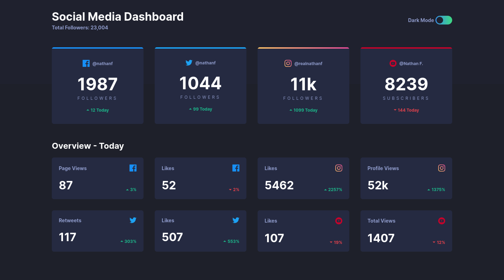
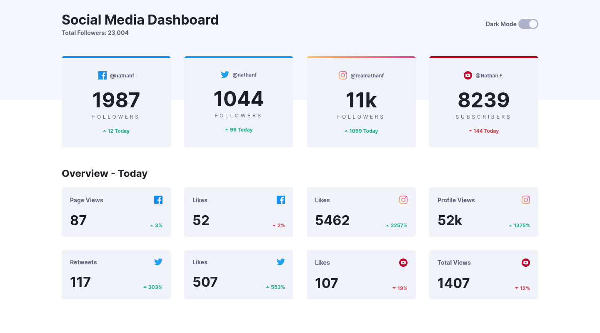
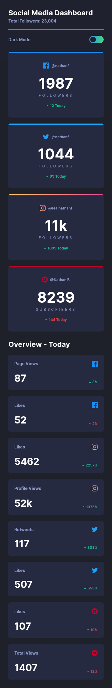
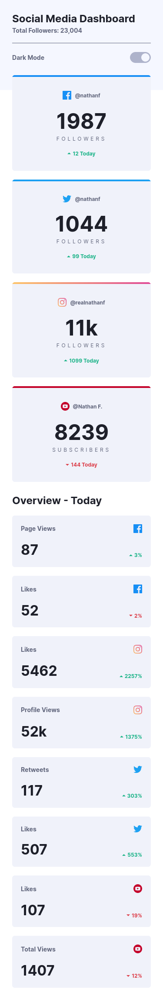

# Frontend Mentor - Social media dashboard with theme switcher solution

This is a solution to the [Social media dashboard with theme switcher challenge on Frontend Mentor](https://www.frontendmentor.io/challenges/social-media-dashboard-with-theme-switcher-6oY8ozp_H). Frontend Mentor challenges help you improve your coding skills by building realistic projects.

## Table of contents

- [Overview](#overview)
  - [The challenge](#the-challenge)
  - [Screenshot](#screenshot)
  - [Links](#links)
- [My process](#my-process)
  - [Built with](#built-with)
  - [What I learned](#what-i-learned)
  - [Continued development](#continued-development)
- [Author](#author)

**Note: Delete this note and update the table of contents based on what sections you keep.**

## Overview

### The challenge

Users should be able to:

- View the optimal layout for the site depending on their device's screen size
- See hover states for all interactive elements on the page
- Toggle color theme to their preference

### Screenshot

### Links

- Solution URL: [Add solution URL here](https://your-solution-url.com)
- Live Site URL: [Github Pages URL](https://loganf50.github.io/social-media-dashboard/)

## My process

### Built with

- Flexbox
- Mobile-first workflow
- TypeScript
- [React](https://reactjs.org/) - JS library
- [Styled Components](https://styled-components.com/) - For styles

**Note: These are just examples. Delete this note and replace the list above with your own choices**

### What I learned

- how to pass props to styled components
  - was making all props optionals to avoid TypeScript errors but was only passing props to outermost component when any styled component using the prop also needed it

## Continued development

- more planning needed
  - cards not all the same at points between breakpoints (could've used grid)
  - had to add wrappers and rearrange items to get right format

## Author

- Frontend Mentor - [@LoganF50](https://www.frontendmentor.io/profile/LoganF50)
